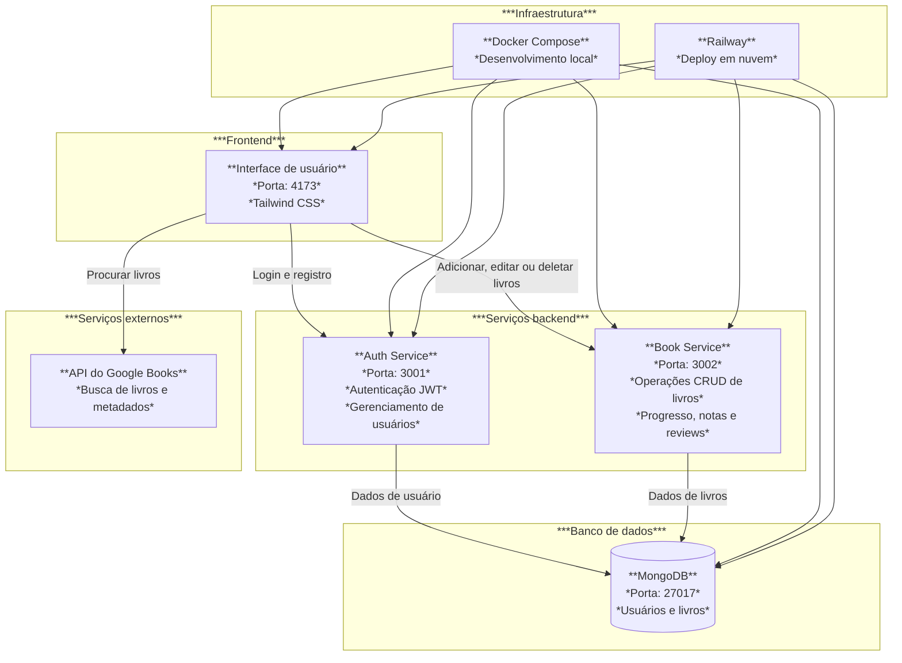

# Livreiro

**Livreiro** é uma aplicação web onde usuários podem registrar e acompanhar livros que já leram, estão lendo ou planejam ler. Permite login, registro, busca de livros via API, adição com capa, descrição, gênero, datas, progresso de leitura, notas e review pessoal.

**Site online:** [https://livreiro.up.railway.app](https://livreiro.up.railway.app)

## Funcionalidades

- Registro e login de usuário com autenticação via JWT
- Busca de livros usando a API do Google Books
- Adição de livros com dados automáticos da API (título, autor, capa, data etc.)
- Lista de livros adicionados por cada usuário
- Edição de dados pessoais do livro: nota, progresso, review, datas
- Remoção de livros
- Interface com Tailwind CSS
- Deploy em nuvem com Docker + Railway

## Tecnologias Utilizadas

- **Frontend**: React, Vite, Tailwind CSS, React Router
- **Backend**: Node.js, Express.js, MongoDB, Mongoose
- **Autenticação**: JSON Web Tokens
- **APIs Externas**: Google Books API
- **Deploy (local ou nuvem)**: Docker, Railway
- **Microsserviços**: `auth-service` (autenticação de usuário) e `book-service` (gerenciamento de livros)

## Como Rodar Localmente (com Docker Compose)

### Pré-requisitos

- Docker
- Docker Compose

### Passos

```bash
git clone https://github.com/SamVeras/Livreiro.git
cd Livreiro
docker compose up --build
```

Acesse em: [http://localhost:4173](http://localhost:4173)

---

## Variáveis de Ambiente

#### auth-service:

| Variável     | Exemplo/valor padrão         |
| ------------ | ---------------------------- |
| `PORT`       | `3001`                       |
| `MONGO_URI`  | `mongodb://mongo:27017/auth` |
| `JWT_SECRET` | `chave_secreta`              |

---

#### book-service:

| Variável     | Exemplo/valor padrão     |
| ------------ | ------------------------ |
| `PORT`       | `3002`                   |
| `MONGO_URI`  | `mongodb://mongo:27017/` |
| `JWT_SECRET` | `chave_secreta`          |

---

#### frontend:

| Variável        | Exemplo/valor padrão             |
| --------------- | -------------------------------- |
| `VITE_API_AUTH` | `http://localhost:3001/api/auth` |
| `VITE_API_BOOK` | `http://localhost:3002/api`      |

## Deploy em Produção (Railway)

Este projeto foi deployado em produção manualmente no Railway, com os serviços configurados individualmente.

**Site online**: [livreiro.up.railway.app](https://livreiro.up.railway.app)

### Como o deploy foi feito:

- Os serviços (`auth-service`, `book-service`, `frontend`) foram adicionados **separadamente** em um projeto Railway.
- O **root** de cada serviço foi ajustado para apontar para a pasta correta no repositório.
- O **banco de dados MongoDB** foi criado diretamente no Railway.
- As **variáveis de ambiente** foram configuradas no painel de cada serviço.
- Os serviços `auth-service` e `book-service` foram configurados para expor _endpoints_ **públicos**, acessados pelo frontend.
- Também foi necessário mudar os comandos de `build` e `start` (mais detalhes podem ser vistos no template).

Caso queira, pode utilizar o [template de deploy no Railway](https://railway.com/deploy/ZdwvCQ?referralCode=BNYRM2), que replica essa configuração.

## Arquitetura


